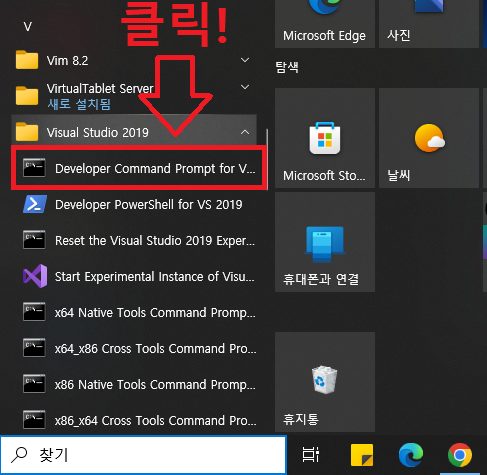
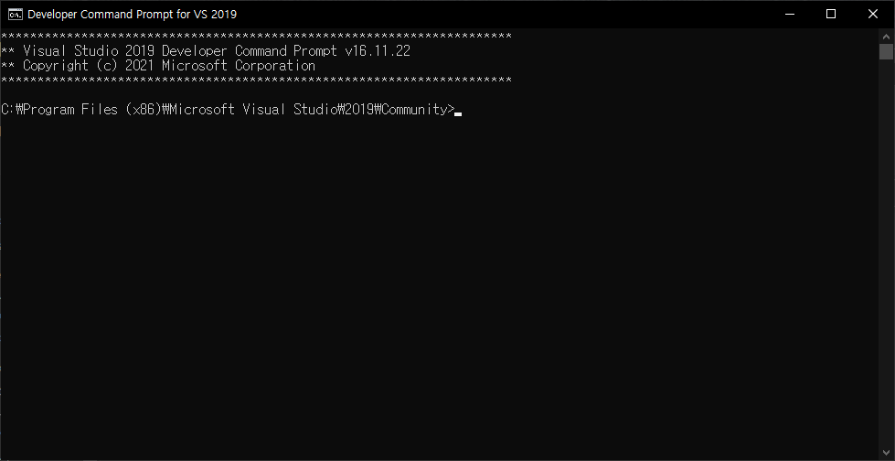
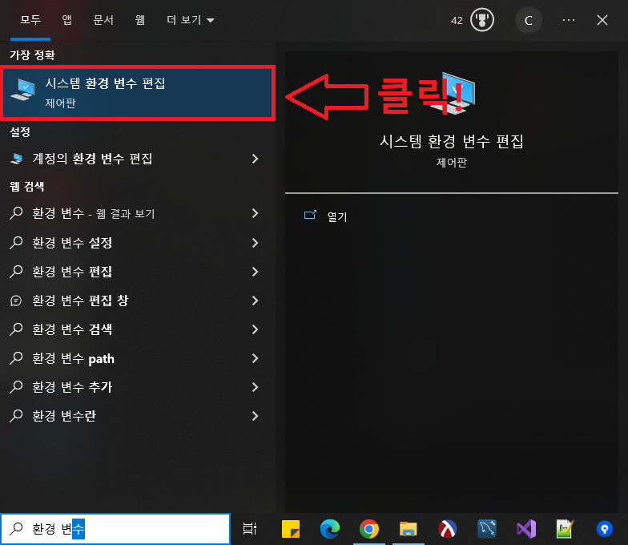
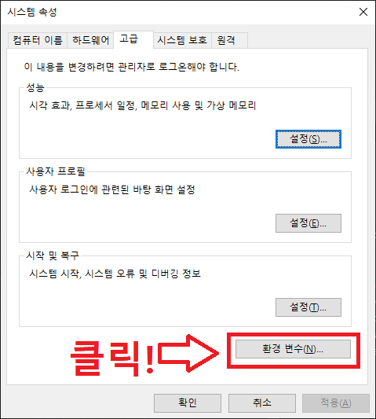
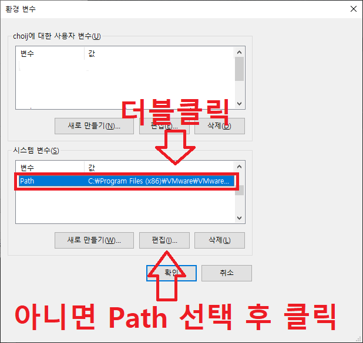
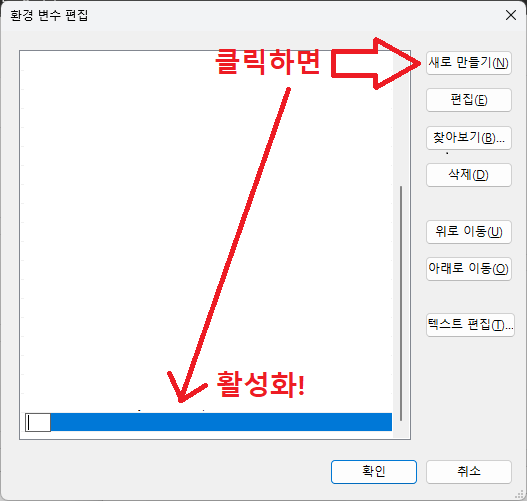

# Hot to use `Build.bat`

이 문서는 `Build.bat` 스크립트 사용방법에 대한 문서입니다.
<br><br>


## `Build.bat` 이란?

`Build.bat`는 `msbuild.exe`를 기반으로 전체 솔루션을 빌드하는 배치 스크립트입니다.
<br><br>


## `Build.bat` 요구 사항

`Build.bat`를 사용하기 위해서는 다음이 필요합니다.
- Visual Studio 2019 or 2022
- `msbuild.exe` 환경 변수 등록

> ※ `msbuild.exe` 환경 변수 등록을 하지 않으면 `Build.bat` 스크립트는 동작하지 않습니다!
<br><br>


## `msbuild.exe` 환경 변수 등록

`msbuild.exe` 환경 변수 등록 절차는 다음과 같습니다. 만약 환경 변수가 이미 등록되어 있다면 이 과정은 생략해도 됩니다.

### 1단계

윈도우 바 하단의 시작 부분에서 `Developer Command Prompt for VS 2019 or 2022`를 실행합니다.


실행하게 되면 다음과 같은 화면을 볼 수 있습니다.


### 2단계

`Developer Command Prompt for VS 2019 or 2022`를 무사히 실행했으면, 다음 명령어를 입력합니다.
```
> where msbuild.exe
C:\Program Files (x86)\Microsoft Visual  Studio\2019\Community\MSBuild\Current\Bin\MSBuild.exe
C:\Windows\Microsoft.NET\Framework\v4.0.30319\MSBuild.exe
```
아래의 두 경로 중 하나를 다음과 같은 형식으로 클립보드에 복사하고 종료합니다.
- C:\Program Files (x86)\Microsoft Visual  Studio\2019\Community\MSBuild\Current\Bin\
- C:\Windows\Microsoft.NET\Framework\v4.0.30319\


### 3단계

아래 윈도우 바의 검색 부분에서 `환경 변수` 라고 검색하면 `시스템 환경 변수 편집` 이 표시되는데, 이를 클릭해서 실행합니다.


실행하면 다음과 같은 화면을 볼 수 있는데, 아래의 `환경 변수(N)...`를 클릭합니다.


다음으로 아래의 시스템 변수 중 Path를 더블 클릭하거나 Path 선택 후 `편집(I)...` 버튼을 클릭합니다.


아래의 새로 만들기(N) 버튼을 클릭하여 이전의 msbuild.exe 경로를 넣어줍니다.


위 과정이 마무리되었으면 종료합니다.


### 4단계

`CMD` 창을 열어서 다음 명령어를 입력합니다.
```
> msbuild.exe --version
.NET Framework용 Microsoft (R) Build Engine 버전 16.11.2+f32259642
Copyright (C) Microsoft Corporation. All rights reserved.

16.11.2.50704
> 
```
만약, 위와 같은 메시지가 뜨지 않는다면 기존의 `CMD` 창을 닫은 후 다시 시도해보고도 동작하지 않는다면 [여기](https://github.com/ChoiJiOne/Tetris3D/issues)에 문의 바랍니다.
<br><br>


## `Build.bat` 사용 방법

`Build.bat`를 사용하기 위해서는 `Tetris3D` 폴더에서 `CMD`를 실행하고 다음 명령어를 입력합니다.
```
Build.bat <visual-studio-version> <mode>
```

이 스크립트가 지원하는 mode는 `Debug`, `Release`, `Shipping`입니다. 각 모드 별 특징은 다음과 같습니다.

| mode | description |
|:---|:---|
| Debug |  빌드 과정에서 최적화를 하지 않고, 디버그 정보 파일(.pdb)을 생성합니다. |
| Release |  빌드 과정에서 최적화는 하지만 디버그 정보 파일(.pdb)을 생성합니다. |
| Shipping | 빌드 과정에서 컴파일러가 할 수 있는 모든 최적화를 수행합니다. | 

만약, `Visual Studio 2019`를 사용하고 있다면 다음과 같이 입력합니다.
```
Debug 모드일 경우...
> Build.bat vs2019 Debug

Release 모드일 경우...
> Build.bat vs2019 Release

Shipping 모드일 경우...
> Build.bat vs2019 Shipping
```

만약, `Visual Studio 2022`를 사용하고 있다면 다음과 같이 입력합니다.
```
Debug 모드일 경우...
> Build.bat vs2022 Debug

Release 모드일 경우...
> Build.bat vs2022 Release

Shipping 모드일 경우...
> Build.bat vs2022 Shipping
```
