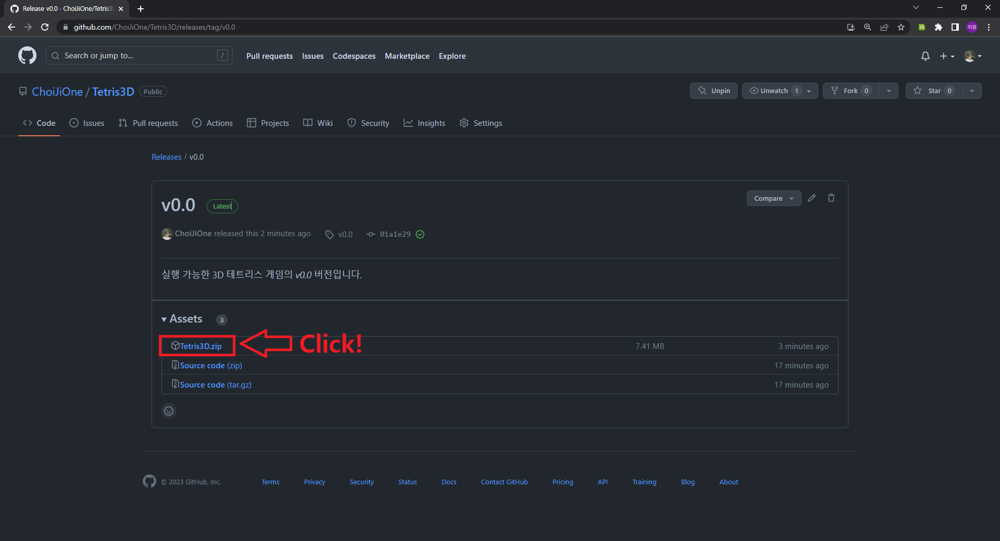
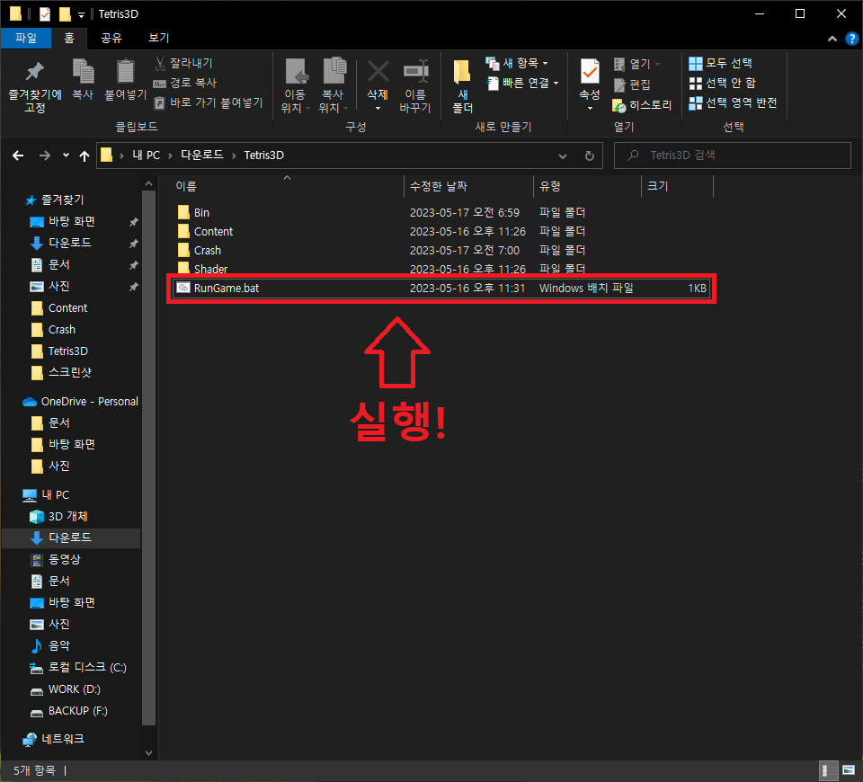
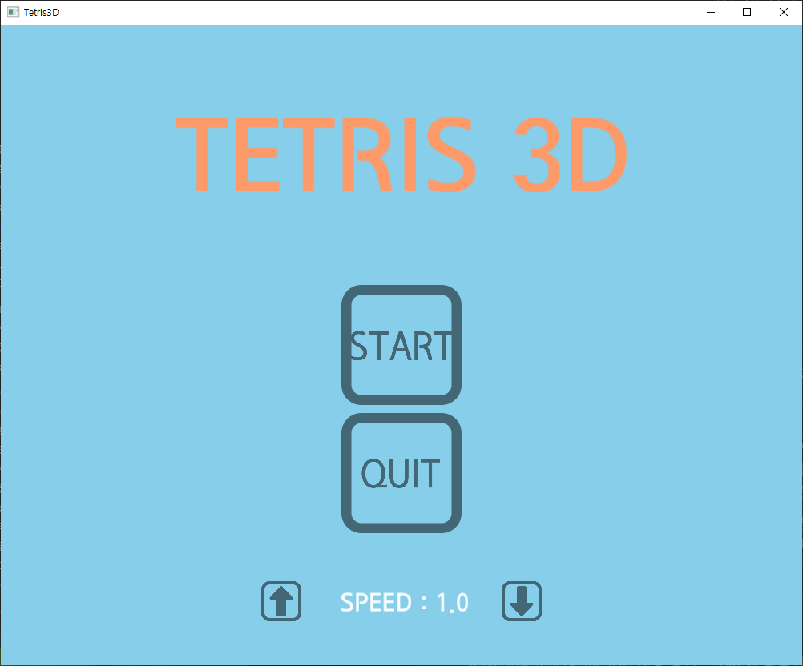
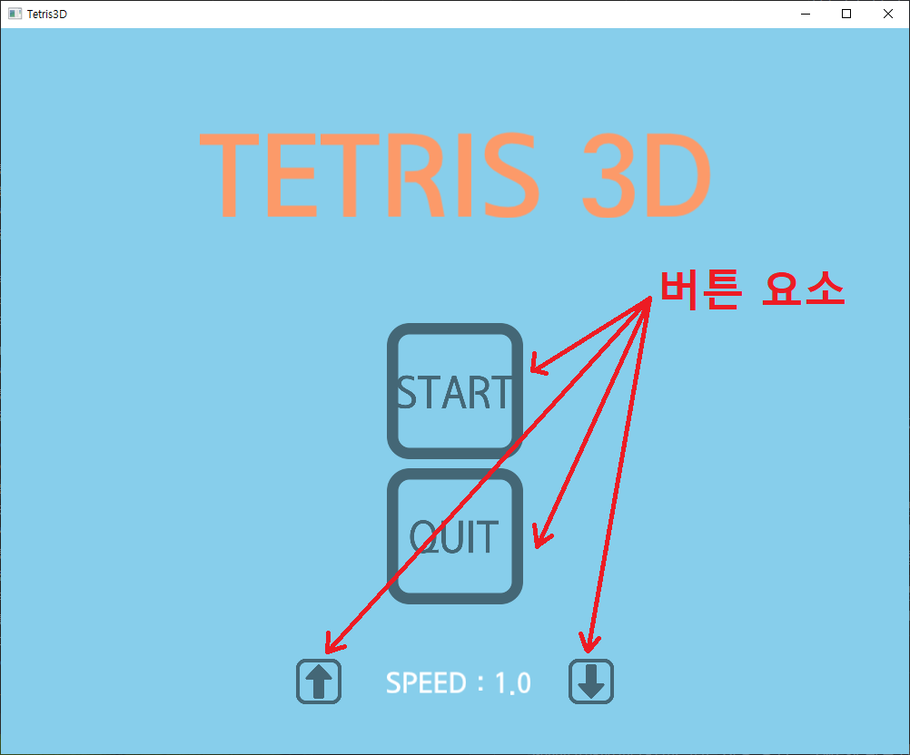
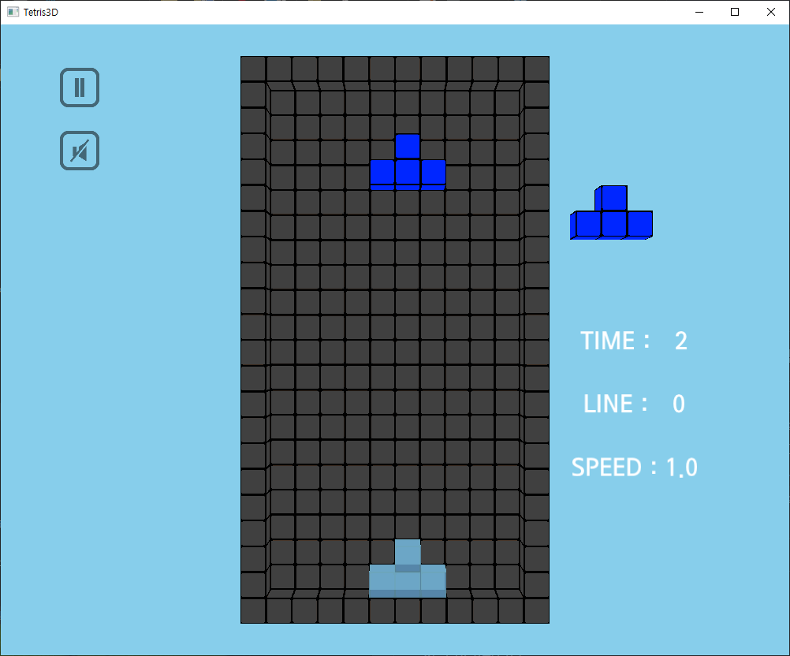
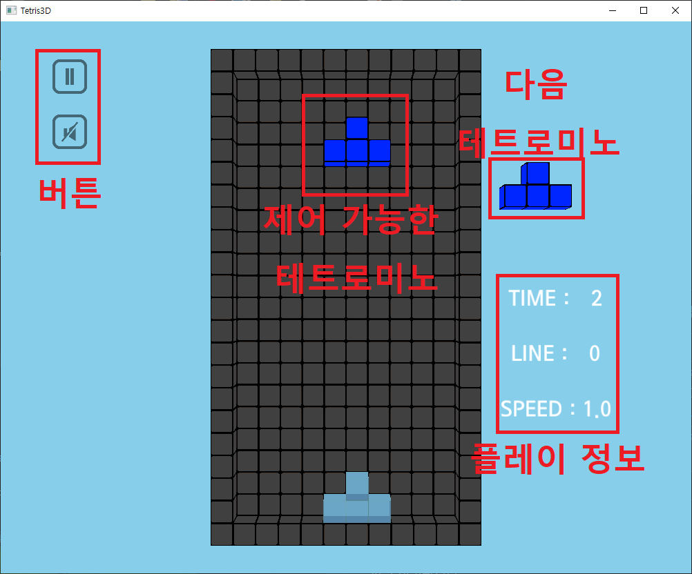
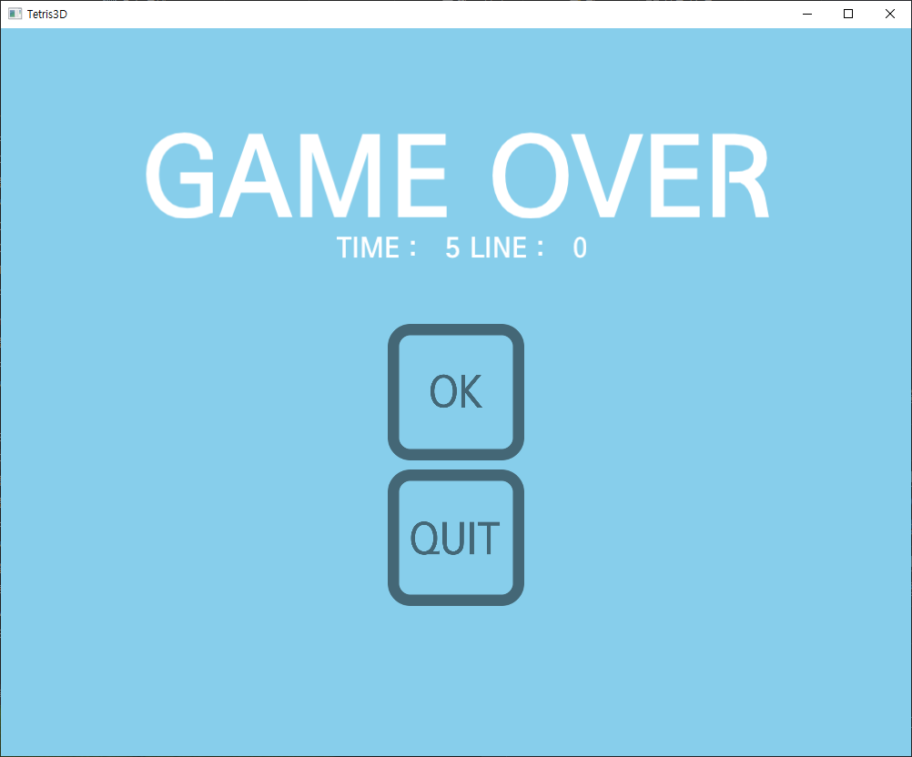
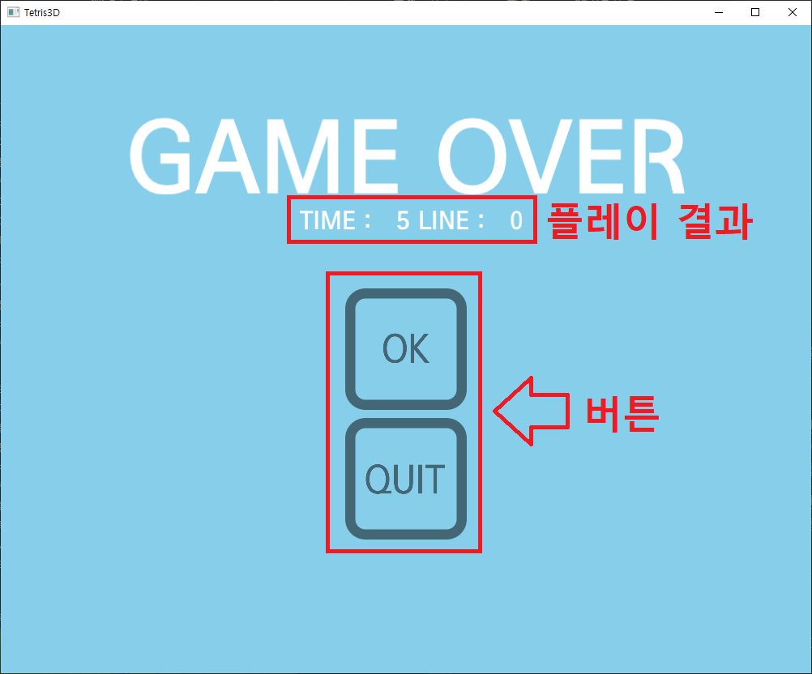

# how to play game

이 문서는 게임 플레이 방법에 대한 문서입니다.
  

## 다운로드

실행 가능한 게임 실행 파일을 얻기 위해서는 [v0.0](https://github.com/ChoiJiOne/Tetris3D/releases/tag/v0.0)으로 이동한 뒤 `Tetris3D.zip`을 클릭합니다.

  

## 게임 실행

다운로드가 완료 되었으면 `Tetris3D.zip`의 압축을 해제합니다. 압축을 해제하면 다음과 같은 구조를 볼 수 있는데, `RunGame.bat`를 실행하면 게임을 실행할 수 있습니다.

  

## 게임 실행 화면

게임 실행 화면은 총 3개로, 아래와 같습니다.

### 시작 화면

게임을 실행하면 아래와 같은 화면을 볼 수 있습니다.

시작 화면 내에는 버튼만 있고, 이 버튼들은 좌측 마우스로 클릭 가능합니다.
게임의 `START` 버튼을 클릭하면 플레이할 수 있고, `QUIT` 버튼을 클릭하면 프로그램이 종료됩니다. 이때, 가장 아래의 위, 아래 화살표 버튼을 클릭하면 테트리스 게임의 속도를 제어할 수 있는데, SPEED의 값이 작아질수록 게임 속도가 빨라집니다.

### 플레이 화면

시작 화면에서 `START` 버튼을 클릭하면 아래와 같은 화면을 볼 수 있습니다.

플레이 화면에서 가장 왼쪽의 UI 요소들은 버튼으로 게임을 중지/재개하거나 사운드 출력의 중단/재개를 할 수 있습니다. 테트로미노의 경우 키보드의 하, 좌, 우 방향 키로 움직일 수 있고, 위 방향키로 회전할 수 있으며 스페이스바로 가장 아래까지 이동할 수 있습니다. 오른쪽의 UI 요소들은 제어할 수 없는 요소로 다음 테트로미노와 플레이 정보를 보여줍니다. 이때 LINE의 경우는 플레이어가 삭제한 라인 수를 보여줍니다. 

### 종료 화면

더 이상 플레이 할 수 없으면 아래의 화면으로 전환됩니다.

타이틀 아래에 플레이어의 플레이 결과를 보여주고, 플레이 결과 아래의 버튼 중 `OK` 버튼을 클릭하면 시작 화면으로 돌아가고 `QUIT` 버튼을 클릭하면 프로그램이 종료됩니다. 
