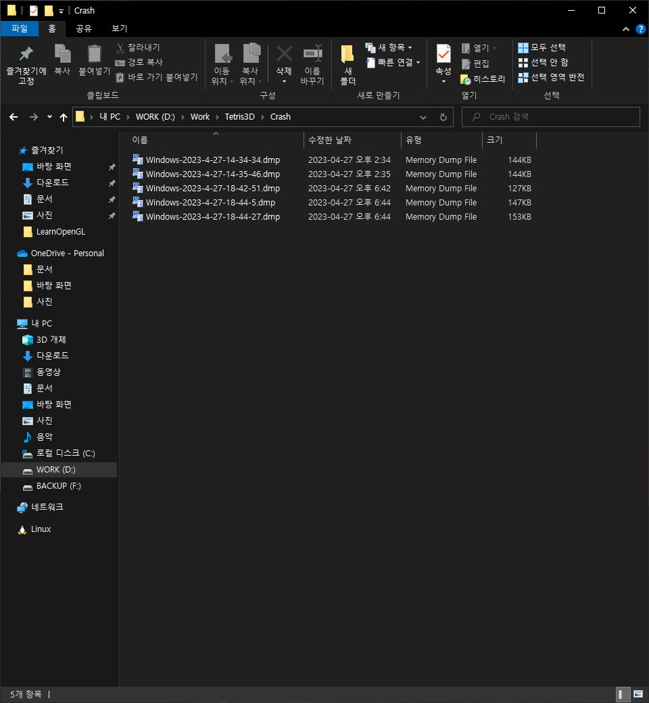

# project crash dump file

이 문서는 프로젝트의 기능 중 하나인 크래시 덤프 파일 수집에 대한 문서입니다.
<br><br>


## 동기

보통 프로그램 개발 도중 에러가 발생하면 디버거를 이용해서 문제를 찾고 해결할 수 있지만, 디버거가 없는 상태에서 문제가 발생할 경우에는 다음 방법을 이용할 수 있습니다.

1. 실행 중인 프로세스를 디버거에 연결한다.
2. 에러가 발생할 경우 로그를 남긴다.
3. 크래시 덤프 파일을 생성한다.

1번의 경우는 에러가 발생한 상황을 재현해야 하는데, 게임 개발에 있어서는 매우 힘든 상황이므로, 이는 고려 대상이 아닙니다. 2번의 경우 에러 상황을 재현하지 않고 로그 메시지를 통해 파악할 수 있지만, 디테일한 분석이 힘드므로 이또한 고려 대상이 아닙니다. 3번의 경우 에러가 발생하면 크래시 덤프 파일을 생성하고 프로그램이 종료되는데, 이때 콜스택 정보나 프로세스 정보 등 에러가 발생한 당시의 정보들이 기록되어 있어 에러를 해결하는데 있어 아주 적합합니다. 따라서, 이 프로젝트에서는 크래시 덤프 수집 기능을 지원하도록 구현하였습니다.
<br><br>


## 크래시 덤프 파일 생성 과정

크래시 덤프 파일을 생성하는 과정은 다음과 같습니다.

### 상황
아래와 같이 텍스처 파일을 로딩하는데, 해당 텍스처 파일이 없는 상황을 가정하겠습니다. 텍스처 로딩에 실패하면 `LoadTextureFromFile` 함수는 `false`를 반환하고 `CHECK` 매크로의 예외 처리 부분이 실행됩니다.  
```
Texture2D::Texture2D(ID3D11Device* device, const std::string& path)
{
	...
	CHECK(LoadTextureFromFile(path, buffer, textureFormat, textureWidth, textureHeight), "failed to load texture file...");
	...
}
```
이 프로젝트에서 `CHECK` 매크로 함수의 구현은 다음과 같습니다.
```
#ifndef CHECK
#define CHECK(EXPRESSION, MESSAGE)\
{\
	if(!EXPRESSION)\
	{\
		CrashHandler::RecordCrashError(__FILE__, __LINE__, MESSAGE);\
		throw std::exception();\
	}\
}
#endif
```
`CrashHandler`의 `RecordCrashError` 에 에러가 발생한 소스 파일 이름, 소스 파일 내 라인, 에러 메시지를 기록하고 빈 표준 예외를 던집니다. 이렇게 표준 예외를 던지면 `Windows` 에서는 해당 표준 예외를 `RaiseException` 으로 변환하게 됩니다. 이렇게 `CHECK`에서 던진 예외는 아래의 `main` 함수에서 처리합니다.
```
int32_t main(int32_t argc, char** argv)
{
#if defined(DEBUG) || defined(_DEBUG)
	_CrtSetDbgFlag(_CRTDBG_ALLOC_MEM_DF | _CRTDBG_LEAK_CHECK_DF);
#endif

	__try
	{
		RunApplication(argc, argv);
	}
	__except (CrashHandler::DetectApplicationCrash(GetExceptionInformation()))
	{
		CrashHandler::CrashErrorMessageBox();
	}

	return 0;
}
```
이렇게 main 함수의 `__except` 에서 받은 예외는 `CrashHandler`의 `DetectApplicationCrash`를 실행하게 되는데, 이 메서드에서 에러가 발생한 시점을 기준올 이름으로 한 크래시 덤프 파일을 생성하게 됩니다. 이때, 크래시 덤프 파일 경로는 `Application.cpp`의 `RunApplication` 함수에서 설정하게 되는데, 설정하는 코드는 다음과 같습니다. 
```
void RunApplication(int32_t argc, char** argv)
{
	CommandLine::Parse(argc, argv);
	CrashHandler::SetCrashDumpFilePath(CommandLine::GetValue("Crash"));
	...
}
```
`CommandLine`의 `GetValue` 메서드를 이용해서 크래시 덤프 파일 경로 값을 가져오는데, 프로그램 시작 시 설정되어 있는 명령행 인자는 다음과 같습니다. 
```
Game.exe Crash=${SolutionDir}..\\Crash\\ Content=${SolutionDir}..\\Content\\ Shader=${SolutionDir}..\\Shader\\
```
따라서, 명령행 인자를 통해서 크래시 덤프 파일의 경로를 임의로 지정할 수 있습니다.
<br><br>


## 수집된 크래시 덤프 파일

수집된 크래시 덤프 파일은 아래와 같이 확인할 수 있습니다.

<br><br>


## 참고
- [MSDN : 크래시 덤프 분석](https://learn.microsoft.com/ko-kr/windows/win32/dxtecharts/crash-dump-analysis)
- [MSDN : Visual Studio 디버거의 덤프 파일](https://learn.microsoft.com/ko-kr/visualstudio/debugger/using-dump-files?view=vs-2022)
- [MSDN : 예외 및 오류 처리에 대한 최신 C++ 모범 사례](https://learn.microsoft.com/ko-kr/cpp/cpp/errors-and-exception-handling-modern-cpp?view=msvc-170)
- [MSDN : RaiseException 함수(errhandlingapi.h)](https://learn.microsoft.com/ko-kr/windows/win32/api/errhandlingapi/nf-errhandlingapi-raiseexception)