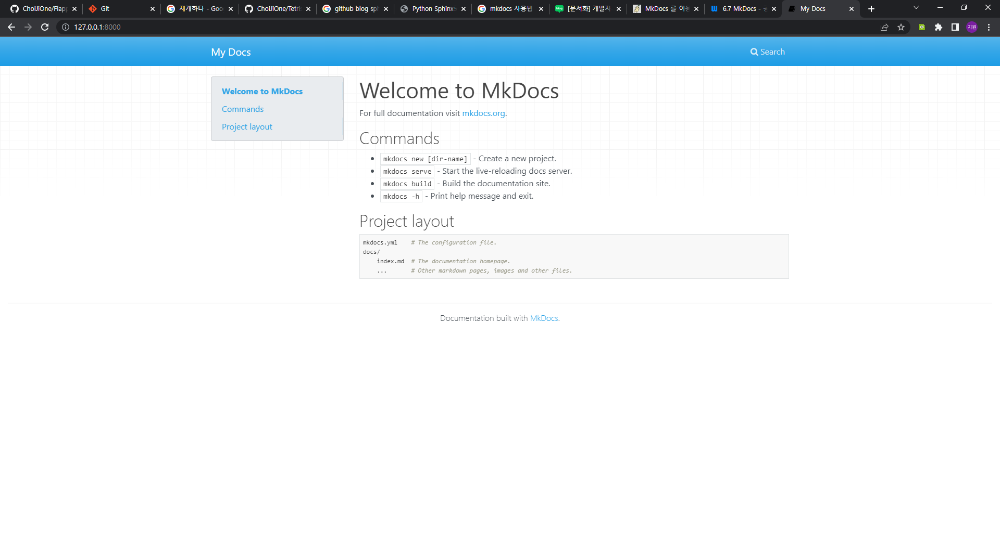
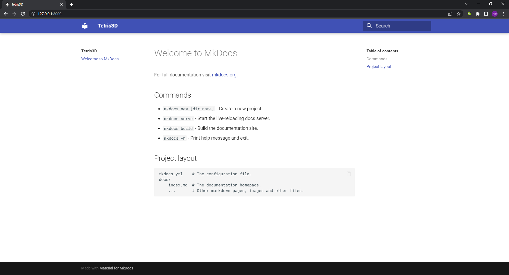
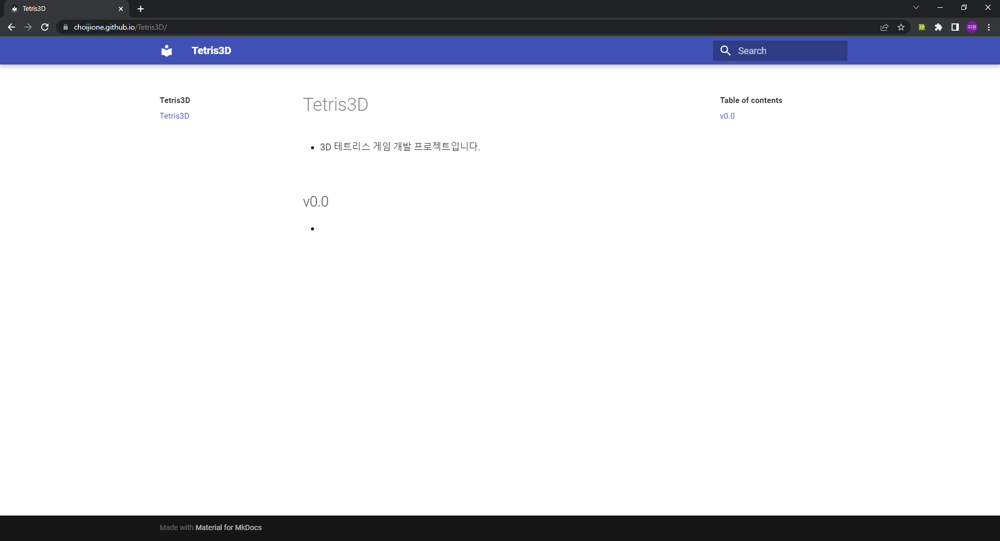

# project github blog

이 문서는 프로젝트 문서를 Github에 정적 호스팅하는 방법에 대한 문서입니다.
<br><br>


## 동기

현재까지 진행한 모든 프로젝트들 중 `Tetris3D`의 *v0.0* 버전은 처음으로 문서를 제공하는데, GITHUB에서 README.md를 읽는 기능만으로는 문서를 제공하는 것이 불편하므로 GITHUB의 정적 호스팅 서비스를 활용하여 조금 더 편하게 문서를 읽을 수 있도록 하기 위해서 진행하게 되었습니다.
<br><br>


## 요구 사항

프로젝트 문서화를 진행하기 위해서는 다음을 필요로합니다.
- [python 3.x](https://www.python.org/)
<br><br>


## mkdocs 설치

`CMD` 창에서 다음 명령어들을 입력합니다.
```
> pip install mkdocs
> pip install mkdocs-material
```
<br><br>


## 프로젝트 생성

프로젝트 문서화를 위해서 `Tetris3D`의 `empty` 브랜치의 복사본을 가져옵니다.
```
> git clone https://github.com/ChoiJiOne/Tetris3D --single-branch -b empty
```

이어서 디렉토리 이동 후 다음 명령어들을 입력하여 mkdocs 프로젝트를 생성합니다.
```
> cd Tetris3D
> mkdocs new docs
INFO     -  Creating project directory: docs
INFO     -  Writing config file: docs\mkdocs.yml
INFO     -  Writing initial docs: docs\docs\index.md
```

생성을 했다면 다음과 같은 구조를 확인할 수 있습니다. 이때, docs 하위의 docs 폴더가 바로 작성한 문서가 위치할 폴더입니다.
```
> tree /F
│  README.md
│
└─docs
    │  mkdocs.yml
    │
    └─docs
            index.md
```

편의상 위와 같은 구조를 아래와 같은 구조로 변경합니다.
```
> tree /F
│  mkdocs.yml
│  README.md
│
└─docs
        index.md
```
<br><br>


## 로컬에서 호스팅

다음 명령어를 이용해서 로컬에서 호스팅할 수 있습니다.
```
> mkdocs serve
INFO     -  Building documentation...
INFO     -  Cleaning site directory
INFO     -  Documentation built in 0.28 seconds
INFO     -  [08:16:11] Watching paths for changes: 'docs',
            'mkdocs.yml'
INFO     -  [08:16:11] Serving on http://127.0.0.1:8000/
```

위의 `http://127.0.0.1:8000/`에 접속하면 아래와 같이 디폴트로 생성된 문서를 볼 수 있습니다.

<br><br>


## material 테마 적용

mkdocs의 material 테마를 적용하기 위해서는 mkdocs.yml 파일을 아래와 같이 변경합니다.
```
site_name: Tetris3D
theme : material
```

변경을 한 뒤 로컬에서 호스팅하여 확인하면 아래와 같이 변경된 것을 확인할 수 있습니다.

<br><br>


## 빌드

다음 명령어를 이용해서 mkdocs를 빌드하면 HTML 파일을 생성합니다.
```
> mkdocs build
```
<br><br>


## 배포

다음 명령어를 이용해서 GITHUB에 배포합니다.
```
> mkdocs gh-deploy
```

배포가 완료되었으면 [https://ChoiJiOne.github.io/Tetris3D/](https://ChoiJiOne.github.io/Tetris3D/)에서 확인할 수 있습니다.

<br><br>


## 참고
- [[문서화] 개발자가 싫어하는 문서화하기 1편 - Sphinx](https://blog.naver.com/pjt3591oo/222067596734)
- [MkDocs 튜토리얼](https://demun.github.io/mkdocs-tuts/)
- [mkdocs-material](https://squidfunk.github.io/mkdocs-material/)