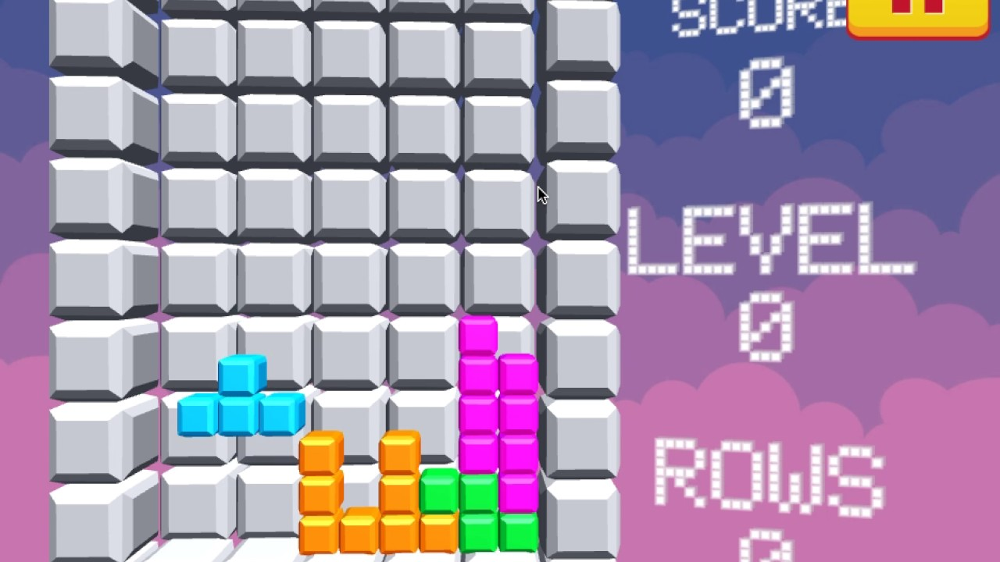

# Project Proposal (프로젝트 제안서)

이 문서는 `Tetris3D`의 *v0.0* 버전 프로젝트의 제안서입니다.
  

## 동기

이 프로젝트를 진행하는 시점에서는 **SDL 내장 렌더러**와 **DirectX 11 API**를 이용해서 2D 게임 개발을 진행해본 경험은 있지만, 3D 게임을 개발해본 적은 없습니다. 따라서, 향후 C++를 이용한 다양한 3D 게임 개발을 위한 경험치를 쌓기 위해서 진행하게 되었습니다.  
  

## 목표

이 프로젝트의 목표는 다음과 같습니다.
> 간단한 3D 테트리스 게임 개발

이 프로젝트의 세부 목표는 다음과 같습니다.
- `Windows Platform` 에서 플레이 가능한 게임 개발
- 핵심 기능들은 모두 `C++17` 를 사용해서 구현
- 렌더링 기능은 `DirectX 11 API`를 사용해서 구현
- 렌더링 이외의 기능은 `다양한 라이브러리`를 이용해서 구현
  - ex. 사운드, 텍스처, 트루 타입 폰트, Json, 윈도우 관리 등등...
- Visual Studio 솔루션 세팅, 업데이트, 빌드 등의 기능을 `자동화할 수 있는 스크립트 개발`
- Github에서 다운로드 받으면 즉시 `실행 가능한 형태`로 배포
  

## 개발 환경

프로젝트 개발 환경은 다음과 같습니다.  

### OS
- Windows 10 Home/Pro
- Windows 11 Home/Pro

### IDLE
- Visual Studio 2019/2022
  

## 기대 수준

프로젝트의 기대 수준은 다음과 같습니다.  

- 아래의 이미지의 수준으로 구현 예정

  

## 기타
- 재사용가능한 Engine 형태로 개발하지 않습니다.
- 크로스 플랫폼을 지원하지 않습니다.
  

## 참고
- [Tetris 3D Unity Sample](https://www.youtube.com/watch?v=Q_ciD2T-J0AS)